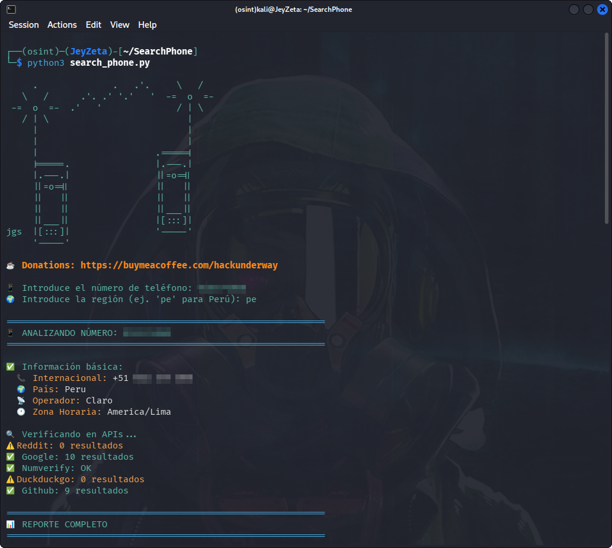
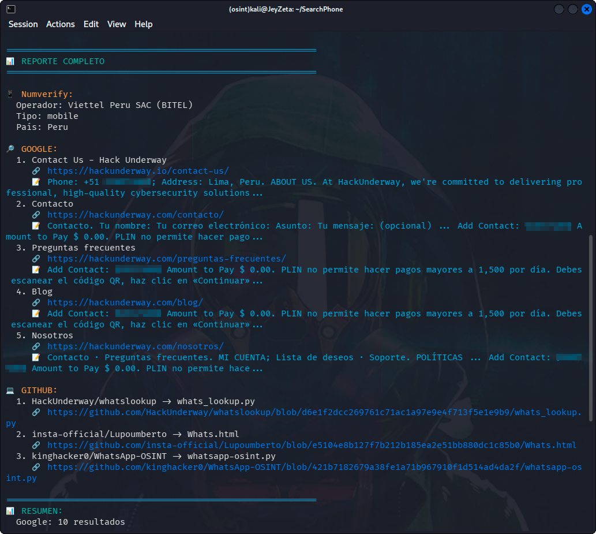
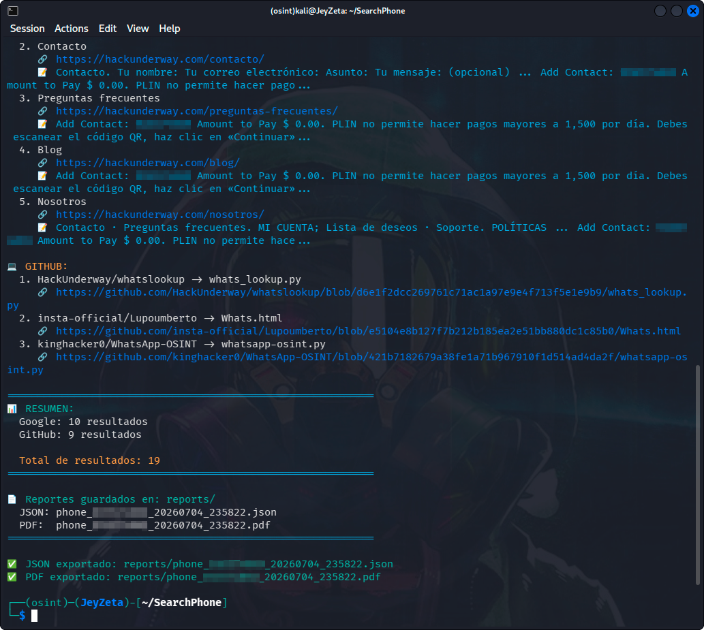

<h1 align="center">SearchPhone 🕵🏽‍♂️</h1>

<p align="center">
Is a comprehensive OSINT tool for looking up linked phone number information, using multiple APIs to gather information from various sources. Developed for use with Python from the terminal. 👁
</p>

<p align="center">

</p>

<p align="center">
  
  
  
  
</p>

## ✨ Features

- 📱 **Phone Number Validation** - Validates and formats phone numbers using phonenumbers library
- 🔍 **Multiple Search Engines** - Searches Google (via SerpAPI) and DuckDuckGo
- 💻 **Code Repository Search** - Finds phone numbers in GitHub code
- 📝 **Social Media Search** - Searches Reddit, Twitter/X, VK, Telegram for mentions
- 📊 **Carrier Information** - Gets operator and location data via Numverify API
- 👤 **Name Search (ФИО)** - Search by full name across DuckDuckGo, Yandex, VK, Telegram, LinkedIn
- 🛡️ **Reputation Check** - Check phone number reputation across spam databases
- � **Automatic Reports** - Generates JSON, CSV, and PDF reports automatically
- 🚀 **Parallel Processing** - Searches multiple sources simultaneously for speed
- 🎨 **Colorful Output** - Easy to read terminal output with colors
- 💾 **Caching System** - Built-in cache with TTL to avoid redundant requests
- 📋 **Batch Processing** - Analyze multiple phone numbers at once

## 🏗️ Project Structure

```
SearchPhone/
├── search_phone.py          # Main entry point
├── src/                     # Modular source code
│   ├── __init__.py
│   ├── config.py            # Configuration & .env loading
│   ├── cache.py             # Caching system (TTL, cleanup)
│   ├── utils.py             # Utility functions
│   ├── sources.py           # Search sources (Google, DDG, etc.)
│   ├── analyzer.py          # PhoneOSINT analyzer class
│   ├── reporter.py          # Export to JSON/CSV/PDF
│   ├── cli.py               # CLI argument parsing & mode
│   └── menu.py              # Interactive menu
├── tests/                   # Test suite
│   ├── __init__.py
│   ├── test_validation.py   # Phone validation tests
│   ├── test_cache.py        # Cache system tests
│   └── test_utils.py        # Utility function tests
├── config.json              # User configuration
├── .env                     # API keys (not tracked)
├── .env.example             # Example environment file
├── requirements.txt         # Python dependencies
├── pyproject.toml           # Project metadata & tool config
├── Makefile                 # Automation commands
├── Dockerfile               # Docker image
├── docker-compose.yml       # Docker Compose setup
├── .pre-commit-config.yaml  # Pre-commit hooks
├── .github/workflows/ci.yml # GitHub Actions CI
├── cache/                   # Cache directory
├── reports/                 # Generated reports
└── logs/                    # Application logs
```

## 🔑 API Keys Required

Get your API keys from the following services:

| Service | Purpose | Link | Plan | Key |
|---------|---------|------|------|-----|
| **Numverify** | Phone number validation & carrier info | [numverify.com](https://numverify.com/) | Free (100 requests/month) | 🔑 (Necessary) |
| **SerpAPI** | Google Search results | [serpapi.com](https://serpapi.com/) | Free (250 searches/month) | 🔑 (Necessary) |
| **GitHub Token** | GitHub code search | [GitHub Settings](https://github.com/settings/tokens) | Free (5000 requests/hour) | 🔑 (Necessary) |

### Configure your API keys:

The project includes an example.env file with the required variables. Follow these steps:

##### Step 1: Copy the example file

```
cp example.env .env
```

##### Step 2: Edit the .env file

```
nano .env
```
#### or
```
vim .env
```
#### or
```
code .env
```

##### Step 3: Add your API keys
Replace the placeholder values with your actual API keys:

```
# Required APIs
NUMVERIFY_KEY=your_numverify_api_key_here
SERPAPI_KEY=your_serpapi_key_here
GITHUB_TOKEN=your_github_token_here
```

## 🚀 Quick Start

### Using pip

```bash
# Clone the repository
git clone https://github.com/HackUnderway/SearchPhone.git
cd SearchPhone

# Install dependencies
pip install -r requirements.txt

# Run the tool
python search_phone.py
```

### Using Make

```bash
make install    # Install dependencies
make run        # Run interactive mode
make test       # Run tests
make lint       # Lint code
make clean      # Clean cache and logs
```

### Using Docker

```bash
make docker-build   # Build Docker image
make docker-run     # Run in Docker container
```

Or manually:

```bash
docker build -t searchphone .
docker run -it --rm \
  -v $(pwd)/.env:/app/.env \
  -v $(pwd)/config.json:/app/config.json \
  -v $(pwd)/reports:/app/reports \
  searchphone
```

## 💻 Usage

### Interactive Mode

Simply run without arguments:

```bash
python search_phone.py
```

### CLI Mode

```bash
# Analyze a single phone number
python search_phone.py --phone +79001234567 --region ru

# Search by full name
python search_phone.py --name "Иванов Иван Иванович"

# Batch analysis from file
python search_phone.py --batch phone_list.txt --region us

# Clear cache
python search_phone.py --cache-clear

# Show recent reports
python search_phone.py --report
```

### CLI Arguments

| Argument | Short | Description |
|----------|-------|-------------|
| `--phone` | `-p` | Phone number to analyze |
| `--name` | `-n` | Full name to search |
| `--batch` | `-b` | File with phone numbers (one per line) |
| `--region` | `-r` | Region code (default: pe) |
| `--cache-clear` | | Clear cache |
| `--report` | | Show recent reports |
| `--no-cache` | | Disable caching |
| `--no-progress` | | Hide progress bar |
| `--format` | `-f` | Export format (json/pdf/csv/all) |

## 🧪 Running Tests

```bash
# Run all tests
python -m pytest tests/ -v

# Run specific test file
python -m pytest tests/test_validation.py -v
```

## 🐳 Docker Support

The project includes Docker support for containerized execution:

- `Dockerfile` - Multi-stage build with Python 3.11-slim
- `docker-compose.yml` - Easy orchestration with volume mounts
- `.dockerignore` - Optimized build context

## 🔧 Configuration

Edit `config.json` to customize:

- **Settings**: region, workers, timeouts, cache, export formats
- **Search**: Enable/disable specific search sources
- **Proxy**: HTTP/HTTPS proxy support (also via environment variables)

## 🔄 CI/CD

GitHub Actions workflow (`.github/workflows/ci.yml`):
- Linting with ruff
- Tests with pytest
- Runs on push/PR to main/master

## 📝 Pre-commit Hooks

```bash
pip install pre-commit
pre-commit install
```

Hooks: trailing-whitespace, end-of-file-fixer, check-yaml, ruff

# Example
<p align="center">

</p>

<p align="center">

</p>

> **The project is open to partners.**

# SUPPORTED DISTRIBUTIONS
|Distribution | Verified version | 	Supported | 	Status |
|--------------|--------------------|------|-------|
|Kali Linux| 2026.2| ✅| Working   |
|Parrot Security OS| 6.3| ✅ | Working   |
|Windows| 11 | ✅ | Working   |
|BackBox| 9 | ✅ | Working   |
|Arch Linux| 2024.12.01 | ✅ | Working   |

# REQUIREMENTS
```
pip install -r requirements.txt
```

# SUPPORT
Questions, bugs or suggestions to : info@hackunderway.com

# LICENSE
- [x] SearchPhone is licensed.
- [x] See [LICENSE](https://github.com/HackUnderway/SearchPhone#MIT-1-ov-file) for more information.

# 👨‍💻 Author

* [Victor Bancayan](https://www.offsec.com/bug-bounty-program/) - (**CEO at [Hack Underway](https://hackunderway.com/)**)

## 🔗 Links
[](https://www.patreon.com/c/HackUnderway)
[](https://hackunderway.com)
[](https://www.facebook.com/HackUnderway)
[](https://www.youtube.com/@JeyZetaOficial)
[](https://x.com/JeyZetaOficial)
[](https://instagram.com/hackunderway)
[](https://tryhackme.com/p/JeyZeta)

## ☕️ Support the project

If you like this tool, consider buying me a coffee:

[](https://www.buymeacoffee.com/hackunderway)

## 🌞 Subscriptions

###### Subscribe to: [Jey Zeta](https://www.facebook.com/JeyZetaOficial/subscribe/)

[](https://www.kali.org/)

from  made in  with  by: <font color="red">Victor Bancayan</font>

© 2026
